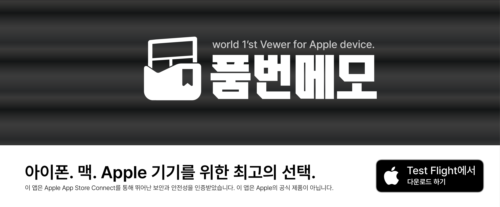

<a href="README.en.md">English</a>

  

<h1 align="center">품번메모</h1>

내가 선택한 사이트의 이미지를 탐색하고, 마음에 드는 작품을 폴더에 모아 보세요.

<a href="https://github.com/nextline-ai/Number-Memo/releases">업데이트</a> · <a href="https://discord.gg/vUTGZNMaMB">문의 및 오류 제보</a>

## 시작하기

1. **주소 입력**을 누르고, 이용할 이미지 사이트의 홈 주소를 입력하세요. 기본 등록된 사이트는 없습니다. 알려진 사이트는 서버 종류가 자동 선택되며, 이름과 계정 정보는 선택 사항입니다.
2. 기존 데이터가 있다면 **Violet** 또는 **Anime Boxes** 백업을 가져오세요. 이 단계는 건너뛰고 설정에서 나중에 진행해도 됩니다.
3. 화면 상단의 **책 / 이미지 전환바**를 누르거나 밀어 만화 모드와 이미지 모드를 전환하세요. 온보딩을 마치면 항상 이미지 모드가 열립니다.
4. 만화 모드에는 라이선스 문제로 기본 연결 사이트가 없습니다. 책 아이콘 → **주소 입력**에서 지원되는 사이트를 직접 연결하세요. 이용 권한이 있는 콘텐츠만 이용해 주세요.

현재 Swift 네이티브 앱은 **iOS 17 이상**을 지원하며 한국어·영어·일본어로 사용할 수 있습니다. 이 문서는 `main`의 최신 기능을 기준으로 합니다. 설치 가능한 버전과 배포 일정은 [배포 안내](https://github.com/nextline-ai/Number-Memo/releases)를 확인하세요.

아직 주소가 없다면 **나중에 설정**으로 시작하세요. 저장·탐색 탭의 **주소 입력**이나 **더보기 → 서버**에서 언제든 추가할 수 있습니다. 알 수 없는 사이트는 도움말에서 서버 종류를 확인해 직접 선택하세요. 연결할 사이트의 이용약관과 콘텐츠 이용 권한도 확인해 주세요.

## 두 가지 모드

| | 만화 모드 | 이미지 모드 (Booru) |
| --- | --- | --- |
| 탐색 | 작품 검색, 인기순, 작가별 작품 | 여러 서버 동시 탐색, 최신순·인기순, 수위 필터 |
| 저장 | 작품 북마크와 폴더 | 이미지 즐겨찾기와 폴더 |
| 검색 | 태그 자동완성, 기본 태그·제외 태그 | 태그 자동완성, 검색 기록, 서버별 제외 태그 |
| 감상 | 전체 화면 읽기, 넘김 방향·연속 스크롤 | 큰 이미지, GIF·동영상, 풀과 노트 |
| 가져오기 | Violet `user.db` / `data.db` | Anime Boxes `.abbj` 백업 |

두 모드의 저장 항목·태그·작가와 화면·뷰어 설정은 분리됩니다. 처음에는 만화가 2열, Booru가 3열로 표시되며 각 모드의 설정에서 바꿀 수 있습니다.

### 만화 모드

- 작품을 폴더로 정리하고 작가를 저장하세요. Safari의 공유 메뉴에서도 작품을 추가할 수 있습니다.
- 기본 검색 태그와 기본 제외 태그를 설정하면 매번 입력할 필요가 없습니다.
- **설정 → 라이브러리 관리**에서 JSON 백업을 내보내거나 복원할 수 있습니다. 파일 앱이나 iCloud Drive에 보관하세요.

### 이미지 모드 (Booru)

- **더보기 → 서버**에서 Danbooru, Gelbooru, Old Gelbooru(v0.1.11, booru.org), Moebooru 계열 서버를 추가하세요. 필요한 서버만 직접 등록할 수 있습니다.
- 상단 서버 메뉴에서 여러 서버를 선택하면 탐색과 저장 탭에 함께 반영됩니다.
- 탐색과 뷰어에서 **이미지를 길게 누르면 저장하고, 다시 길게 누르면 해제**합니다. 뷰어 메뉴의 **폴더에 저장**으로 폴더를 선택하세요.
- 인기순은 점수가 높은 순서입니다. 옆의 **수위** 메뉴에서 필터를 선택하세요. **전체 수위**는 자동 수위 필터를 적용하지 않습니다.
- **더보기 → 풀**에서 순서가 있는 이미지 모음을 볼 수 있습니다. 노트가 있는 이미지에서는 번역·설명 노트도 확인할 수 있습니다.

화면·언어·탐색·미디어 설정은 **더보기**에서 바로 조절할 수 있습니다.

Booru 즐겨찾기는 앱에 저장됩니다. 사이트 계정의 즐겨찾기와 자동으로 동기화되지는 않습니다. 동영상·풀·노트의 지원 범위는 서버와 기기에 따라 다릅니다.

## 저장·검색·동기화

- 모드를 전환해도 같은 위치의 탭이 열리고, 탐색의 검색어와 불러온 결과가 유지됩니다. 검색어를 비운 뒤 아래로 당기면 기본 탐색을 새로 불러옵니다.
- 두 모드 모두 폴더 안에서는 길게 눌러 메뉴를 열거나, 상단 **선택**으로 여러 항목을 이동·삭제할 수 있습니다. 폴더를 길게 누르면 이름·색상·순서를 바꿀 수 있습니다.
- 검색 기록 옆 **별표**로 여러 태그를 포함한 검색어 전체를 **저장한 검색**에 보관하세요. 기록은 기본적으로 최근 3일만 남으며, 밀어서 개별 삭제하거나 제목 옆 휴지통으로 지울 수 있습니다. 저장한 검색은 기록을 지워도 남습니다.
- **iCloud 동기화는 기본으로 켜져 있습니다.** 같은 Apple 계정의 iCloud Drive를 켜면 저장 항목, 폴더 색상·순서, 작가, 검색과 일반 설정을 합칩니다. 각 모드의 설정에서 끌 수 있으며 기존 데이터는 유지됩니다.
- 화면 열 수, 재생 설정, 미디어 캐시, 서버 계정 키와 브라우저 쿠키는 기기마다 따로 유지합니다.

## 뷰어와 번역

가운데를 탭해 메뉴를 열고, 가장자리를 탭하거나 좌우로 밀어 이동하세요. 두 번 탭하거나 두 손가락으로 이미지를 확대할 수 있습니다. Booru 뷰어에서는 기본 배율에서 아래로 밀어 닫습니다. 동영상은 음소거 상태로 자동 재생되며, 재생 컨트롤에서 소리를 켤 수 있습니다. 상세정보에서 게시물 ID를 확인하고 복사할 수 있습니다.

이미지의 **번역** 메뉴는 Apple의 텍스트 인식·번역을 사용합니다. 기본 번역 언어는 시스템 언어이며, 각 모드의 설정에서 직접 선택할 수 있습니다. 사용자 지정 번역 언어는 iOS 18 이상에서 지원됩니다. 앱 표시 언어도 설정에서 바꿀 수 있습니다.

## 연결이 안 될 때

일시적인 연결 끊김은 최대 3회 자동 재시도합니다. 계속 실패하면 다음을 확인하세요.

1. Booru 오류 화면이나 서버 설정에서 **클라이언트 확인**을 여세요. 열린 사이트에서 확인 절차를 완료한 뒤 **완료**를 누르면 다시 불러옵니다. 일부 검색은 해당 검색 페이지에서 추가 확인이 필요할 수 있습니다.
2. 문제가 계속되면 **더보기 → 내장 브라우저 사용**을 켜세요. 오류 화면에서도 바로 전환할 수 있으며, 브라우저의 그리드 버튼으로 기본 탐색 화면에 돌아옵니다.
3. booru.org 계열에서 검색이 안 되면 수위를 **전체 수위**로 선택해 보세요. 필요한 경우 서버 설정에서 계정 정보를 입력하거나 쿠키를 초기화할 수 있습니다.

**Danbooru는 일반 계정의 검색 태그 수를 보통 2개로 제한합니다.** 더 많은 태그를 검색하려면 유료 계정으로 업그레이드하고 앱의 서버 설정에 사용자 이름과 API 키를 입력하세요. **Gelbooru에는 이 2개 태그 제한이 없습니다.**

만화에도 설정의 **내장 브라우저에서 열기** 옵션이 있습니다. 처음 사용 안내는 각 모드의 설정에서 다시 볼 수 있습니다.

## 개발자 및 커뮤니티

- **개발자:** NextLine
- **이메일:** [contact@nextline.work](mailto:contact@nextline.work)
- **웹사이트:** [nextline.work](https://nextline.work)
- **커뮤니티 / 버그 제보:** [Discord](https://discord.gg/vUTGZNMaMB)

Booru의 **더보기**, 만화의 **설정** 하단에서도 개발자 정보와 링크를 찾을 수 있습니다.

불편한 점은 [Discord 커뮤니티](https://discord.gg/vUTGZNMaMB)에 남겨 주세요. 사용한 앱 버전·기기·재현 방법을 적어 주시면 도움이 됩니다.

품번메모는 Apple 및 지원 사이트와 무관한 독립 클라이언트입니다.
[개인정보처리방침](docs/privacy-policy.md) · [App Store 출시 점검](docs/app-store-review.md)
