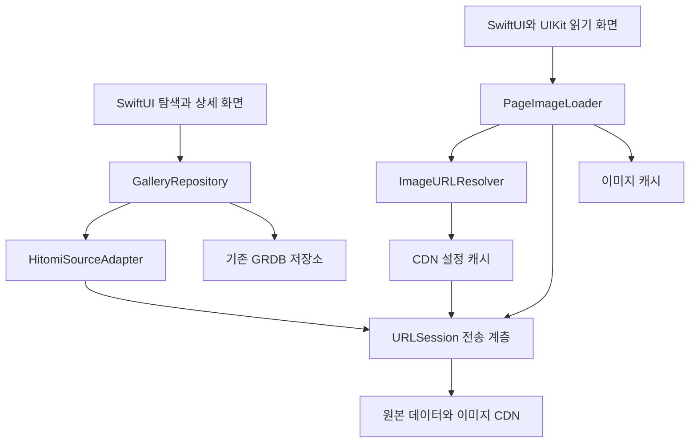

# 네이티브 콘텐츠 화면 전환 검토

검토일: 2026년 10월 4일, 한국 시간. 범위는 기술 검증과 설계 제안이다.

후속으로 네이티브 래퍼를 구현하고 실제 iPhone에서 검증했다. 아래 내용은 구현 전 연구 기록이며, 현재 코드와 검증 범위는 [구현 기록](IMPLEMENTATION.md)을 참조한다.

**권장안은 앱 내부의 데이터 처리 계층과 SwiftUI 읽기 화면을 만들고, 필요한 데이터와 이미지를 원본 CDN에서 직접 받는 구조다. 자체 중계 서버를 초기 필수 요소로 둘 근거는 발견하지 못했다.** 실제 Foundation 네트워크 요청으로 목록 일부, 기존 앱의 메타데이터 파싱, 이미지 주소 계산과 이미지 헤더 응답을 확인했다. 다만 iPhone에서의 이미지 디코딩과 전체 검색·읽기 경험까지 검증한 결과는 아니다.

기존 작업은 `main`의 [`3fa38f9`](https://github.com/nextline-ai/Number-Memo/commit/3fa38f9)에 보존했다. 이 연구는 `codex/native-content-wrapper-study` 브랜치에서 진행했으며 앱 타깃에 연결하지 않은 검증 프로그램과 문서로 구성한다.

## 검증 결과와 그 한계

[Probe.swift](Probe.swift)를 기존 [HitomiAPIClient.swift](../../native-ios/NumberMemo/Core/Network/HitomiAPIClient.swift)와 함께 macOS 명령행 프로그램으로 컴파일했다. 브라우저나 별도 서버 없이 Foundation `URLSession`을 사용했다. 결과 원본과 제어 파일의 SHA-256은 [evidence.json](evidence.json)에 있다.

| 검증 대상 | 관측 결과 | 여기서 판단할 수 있는 범위 |
| --- | --- | --- |
| 현재 CDN의 `common.js`, `gg.js`, `searchlib.js`, `search.js` | HTTP 200 | 해당 시점에 제어 파일을 직접 요청할 수 있음 |
| 한국어 목록의 첫 256바이트 | HTTP 206, 64개 ID에 해당하는 길이 | 목록 전체를 받지 않고 일부를 요청할 수 있음 |
| 목록의 첫 작품을 기존 앱 클라이언트로 조회 | 제목 필드와 파일 목록 파싱 성공, 첫 파일 해시 일치 | 현재 앱의 메타데이터 접근을 재사용할 수 있음 |
| 이미지 주소 계산용 설정 | 관측한 형식의 라우팅 테이블 파싱 성공 | 원격 스크립트를 실행하지 않고 현재 형식을 처리할 수 있음 |
| 계산한 WebP·AVIF 이미지 주소 | HEAD 요청 HTTP 200, 각 이미지 MIME 유형 확인 | 자체 서버 없이 이미지 엔드포인트에 도달함. 이미지 본문·디코딩은 미검증 |
| 검색 인덱스 버전과 루트 노드 | 버전 조회와 464바이트 Range 요청 검증 | 검색 인덱스 접근 가능. 실제 검색어 처리·정확도·속도는 미검증 |
| 기존 대체 호스트 `ltn.hitomi.la` | 이 환경에서는 이름 해석 실패, `NSURLErrorDomain -1003` | 구 호스트를 항상 작동하는 대체 경로로 가정하면 안 됨 |

본문 콘텐츠, 작품 ID, 이미지 주소와 이미지는 결과 파일에 저장하지 않는다. 이미지에는 HEAD만 요청하며 원격 JavaScript는 실행하지 않는다. 이 검증은 macOS의 한 네트워크 환경과 한 작품 표본에 대한 것이다. 전체 작품, 모든 형식, iOS 기기, 이동통신망, 장시간 동작을 대표하지 않는다. 실행 시점마다 목록과 CDN 설정이 바뀌므로 파일 수와 해시가 달라질 수 있다.

별도 Python 사전 점검에서는 사이트 홈페이지 연결이 재설정되는 동안 현재 CDN은 응답했다. 이는 해당 환경의 관측이며 원인이나 지역별 접근 가능성을 판정한 것은 아니다. 홈페이지 연결 상태와 콘텐츠 데이터 경로의 상태를 따로 다뤄야 한다.

## 지금 코드에서 이미 가능한 부분

현재 앱은 전부 웹에 의존하는 구조가 아니다. 저장 목록과 상세 화면은 이미 SwiftUI이고, 표지·제목·태그도 앱이 직접 요청한다.

| 코드 | 현재 역할 | 전환할 때 할 일 |
| --- | --- | --- |
| [HitomiAPIClient](../../native-ios/NumberMemo/Core/Network/HitomiAPIClient.swift) | 작품 메타데이터, 파일 해시, 표지 다운로드 | 한 번의 메타데이터 요청으로 페이지 파일명·크기·형식 정보까지 보존하도록 확장 |
| [CoverQueueActor](../../native-ios/NumberMemo/Core/Network/CoverQueueActor.swift) | 메타데이터·표지 작업 큐 | 읽기용 고해상도 이미지 요청과 우선순위 분리 |
| [당시 InAppHitomiBrowserView](https://github.com/nextline-ai/Number-Memo/blob/3fa38f91f94770ba1d9eb8d92fc3d8864bce0027/native-ios/NumberMemo/Presentation/Browser/InAppHitomiBrowserView.swift) | 원본 페이지 로딩, 페이지 이동 JS, 북마크, 화면 캡처 기반 Live Text | 읽기·탐색 화면과 기능별로 교체 |
| [WorkDetailView](../../native-ios/NumberMemo/Presentation/Works/WorkDetailView.swift) | 저장된 작품 편집·상세, 브라우저 열기 | 직접 읽기 화면으로 이동하는 첫 진입점 |
| [AppRootTabView](../../native-ios/NumberMemo/Presentation/Navigation/AppRootTabView.swift), [WorksGridView](../../native-ios/NumberMemo/Presentation/Works/WorksGridView.swift), [ArtistsListView](../../native-ios/NumberMemo/Presentation/Artists/ArtistsListView.swift) | 홈·작품·작가별 브라우저 진입 | 각 진입점을 네이티브 탐색 경로에 연결 |
| [AppEnvironment.verifySite](../../native-ios/NumberMemo/App/AppEnvironment.swift) | 입력 문자열을 확인해 이용 상태 저장 | 실제 네트워크 연결 검사와 별개임을 유지하고, 오류 상태를 따로 제공 |

표지 URL을 읽기용 원본 URL로 그대로 사용할 수는 없다. 현재 표지는 축소 이미지 경로를 사용하고, 원본 이미지에는 별도의 호스트 선택과 갱신되는 경로 설정이 필요하다. `fetchGalleryFiles`는 지금 해시만 반환하므로 완전한 페이지 모델도 추가해야 한다.

## Violet의 서버가 의미하는 것

이전 Flutter 앱 구조를 보존한 `Saebasol/violet`의 `b7f13370e9b361abf984d465a6a1c8519ab5f913`를 조사했다. 사용자가 쓰던 특정 릴리스와 동일한 버전이라는 보장은 없다. 현재 `project-violet/violet` 주소에는 별도의 새 웹 중심 프로젝트가 있으므로 두 세대의 구조를 섞어 판단하지 않았다.

- **검색용 데이터 배포:** [SyncManager](https://github.com/Saebasol/violet/blob/b7f13370e9b361abf984d465a6a1c8519ab5f913/violet/lib/version/sync.dart)는 버전 정보와 DB·증분 데이터를 동기화한다. [QueryManager](https://github.com/Saebasol/violet/blob/b7f13370e9b361abf984d465a6a1c8519ab5f913/violet/lib/database/query.dart)는 로컬 DB에서 검색한다.
- **부가 서비스:** [VioletServer](https://github.com/Saebasol/violet/blob/b7f13370e9b361abf984d465a6a1c8519ab5f913/violet/lib/server/violet.dart)에는 순위 등의 API가 있다. [포크 README](https://github.com/Saebasol/violet/blob/b7f13370e9b361abf984d465a6a1c8519ab5f913/README.md)도 서버를 이용 행동 기반 통계 서비스로 설명한다.
- **이미지 처리:** [ScriptManager](https://github.com/Saebasol/violet/blob/b7f13370e9b361abf984d465a6a1c8519ab5f913/violet/lib/script/script_manager.dart)는 클라이언트에서 메타데이터를 받아 이미지 URL 목록을 계산한다. [HitomiImageProvider](https://github.com/Saebasol/violet/blob/b7f13370e9b361abf984d465a6a1c8519ab5f913/violet/lib/component/hitomi/hitomi_provider.dart)는 그 URL과 요청 헤더를 사용한다. CDN 설정을 클라이언트에서 갱신하는 코드도 있다.

따라서 **서버가 있다는 사실을 이미지 전부를 중계해야 한다는 기술적 제약으로 해석할 수 없다.** 확인한 구조에서는 DB 배포, 통계, URL 계산용 스크립트 배포가 분리되어 있다. 당시 배포 스크립트가 실제로 반환했던 모든 호스트까지 확인한 것은 아니다. 참조하는 `project-violet/scripts` 저장소는 조사 시점 GitHub API에서 404였으며, 이 결과만으로 삭제·비공개 여부를 구분할 수 없다.

설계상 참고할 점은 검색 데이터와 URL 변경에 대한 유지보수다. Violet이 왜 그 구조를 선택했는지에 대한 개발자의 의사결정 기록은 확인하지 못했다.

## 가능한 접근 방식 비교

| 방식 | 광고 처리 | 편의 기능 확장 | 주요 의존성 | 판단 |
| --- | --- | --- | --- | --- |
| 기존 웹뷰에 차단 규칙·CSS 적용 | 지정한 광고 요청과 요소 차단 | 원본 DOM·동작에 제약 | 원본 페이지 구조 | 단기 개선 가능 |
| 앱에 포함한 HTML 화면과 네이티브 데이터 계층 | 원본 페이지·광고 스크립트를 로드하지 않음 | 앱이 작성한 화면 안에서 확장 | 자체 HTML 렌더러와 브리지 | 가능하지만 현재 SwiftUI 앱에서는 추가 계층이 됨 |
| SwiftUI·UIKit 화면과 네이티브 데이터 계층 | 필요한 데이터·이미지만 요청 | 페이지 이동, 메모, 확대, 읽기 진행률 등을 앱이 제어 | 데이터 형식과 CDN 규칙 | **우선 권장** |
| 자체 서버가 데이터를 가공해 앱에 전달 | 앱에 정제한 응답 제공 | 서버에서 검색·가공 가능 | 서버 운영·가용성·전송 비용 | 추가 요구가 생길 때 검토 |

유료 광고 차단 앱이 기술적으로 필수인 것은 아니다. WebKit에는 앱 내부 콘텐츠 차단 규칙을 지원하는 [WKContentRuleListStore](https://developer.apple.com/documentation/webkit/wkcontentruleliststore)가 있다. 다만 차단만 추가하면 원본 화면의 편의 기능 부족까지 해결되지는 않는다.

로컬 HTML 방식도 원본 웹사이트를 띄우는 것과 구분할 수 있다. 앱이 작성한 화면에 구조화된 데이터를 공급하면 된다. 이 경우에도 네트워크 요청은 네이티브 계층에서 처리하는 쪽이 역할을 명확히 한다. [WKURLSchemeHandler](https://developer.apple.com/documentation/webkit/wkurlschemehandler)는 WebKit이 처리하지 않는 사용자 정의 스킴용이며, 임의의 HTTP·HTTPS 요청을 모두 가로채는 기능으로 설계하면 안 된다. HTTP 통신에는 Apple이 권장하는 [URLSession](https://developer.apple.com/documentation/technotes/tn3151-choosing-the-right-networking-api)을 사용할 수 있다.

## 권장 구조

여기서 래퍼는 앱 안에 두는 소스별 데이터 처리 계층이다. 사이트가 제공하는 목록·메타데이터·이미지 정보를 앱의 안정적인 모델로 바꾼다.



이는 제안 구조다. 화면은 `GalleryID`, `GalleryMetadata`, `GalleryPage` 같은 앱 모델을 받고 사이트 URL 규칙을 알지 않게 한다. 페이지 모델에는 해시, 순서, 파일명, 가로·세로 크기, 지원 형식을 담는다. URL은 요청 직전에 계산하고 갤러리 메타데이터와 함께 영구 저장하지 않는다.

`HitomiSourceAdapter`는 메타데이터 래퍼를 엄격하게 벗겨 JSON으로 읽고 필드와 크기를 검증한다. 기존처럼 응답에서 첫 `{`를 찾는 완화된 파싱을 새 데이터 계층의 계약으로 고정하지 않는다. 원격 JavaScript를 통째로 실행하지 않는다. 실제 [common.js](https://ltn.gold-usergeneratedcontent.net/common.js)에는 이미지 URL 도우미와 광고 로딩 동작이 함께 있으므로 파일 전체를 재사용하는 방식은 피한다.

`ImageURLResolver`는 [gg.js](https://ltn.gold-usergeneratedcontent.net/gg.js)의 관측 가능한 데이터 형식에서 설정을 추출한다. 형식이 달라지면 명시적인 오류를 내고 원격 코드 실행으로 전환하지 않는다. 설정에는 갱신 정책을 두고, 이미지 요청에서 설정 만료가 의심될 때 한 번 갱신 후 재시도한다. 403, 삭제된 파일, 잘못된 형식을 모두 같은 원인으로 단정하거나 무한 재시도하지 않는다. 캐시의 논리 키는 파일 해시와 형식을 기준으로 하고 CDN 호스트·일시적 경로와 분리한다.

`PageImageLoader`는 현재 페이지를 우선하고 인접 페이지만 미리 받는다. 빠른 페이지 전환 시 불필요한 작업을 취소하며, 표시 크기에 맞게 디코딩해 전체 작품의 고해상도 이미지를 동시에 메모리에 올리지 않는다. 요청 호스트·리디렉션, 응답 유형, 전송량을 검증하고 표준 TLS 검증을 유지한다. 기존 저장소와 iCloud 동기화에는 이미지 캐시를 섞지 않는다.

기존 Live Text는 웹뷰 캡처에서 얻은 이미지를 분석한다. 직접 읽기 화면에서는 현재 페이지 이미지를 같은 VisionKit 계층에 전달하는 방향을 검증할 수 있다. 실제 번역 메뉴 제공 여부, 지원 기기·언어, 확대 상태와의 상호작용은 기기 검증이 필요하다.

## 검색에서 남은 일

작품 번호로 여는 읽기 화면과 전체 카탈로그 검색은 별도 작업이다. [search.js](https://ltn.gold-usergeneratedcontent.net/search.js)에는 목록 파일 조회, 필터에 따른 목록 선택, 검색어 해시와 트리 인덱스 조회, Range 요청을 이용하는 검색 흐름이 있다. [searchlib.js](https://ltn.gold-usergeneratedcontent.net/searchlib.js)는 인덱스 버전과 관련 설정을 제공한다. 따라서 자체 검색 서버가 유일한 선택지는 아니다.

이번 검증은 기존 경로의 목록 일부와 검색 트리의 루트 노드 접근까지다. 현재 사이트 코드가 사용하는 `/n/` 목록 경로와 기존 경로의 동등성, 전체 목록의 압축 처리, 제외 검색·복수 조건·정렬·검색 제안의 정확성은 별도 확인해야 한다. 일부 목록을 Range로 받았다는 결과를 임의의 전체 검색이 효율적으로 된다는 증거로 사용하지 않는다.

초기 권장 순서는 저장된 작품의 읽기, 목록·작가·언어별 탐색, 전체 검색이다. 전체 검색이 단말의 지연·메모리·데이터 사용 목표를 만족하지 못할 때 검색 인덱스 배포나 검색 전용 서버를 비교한다. 서버가 필요하더라도 이미지 중계까지 같은 서버로 묶을 필요는 없다.

## 후속 구현과 완료 기준

| 단계 | 구현 범위 | 완료 판단 |
| --- | --- | --- |
| 1. 네이티브 읽기 검증 | 저장된 작품 한 개를 직접 읽는 화면, 확대, 페이지 이동, 오류·재시도 | 실제 iPhone에서 여러 작품과 이미지 형식 표시, 마지막 페이지 이동, 회전, 백그라운드 복귀 확인 |
| 2. 읽기 안정화 | 제한된 미리 받기, 캐시, 진행률, Live Text, 북마크 연결 | 긴 작품·빠른 스와이프의 메모리 측정, CDN 설정 변경 후 복구, 오프라인 상태 확인 |
| 3. 탐색 전환 | 홈 목록, 언어·작가별 탐색, 원격 작품 상세 | 모든 기존 브라우저 진입점의 대응 경로와 빈 결과·삭제·네트워크 오류 확인 |
| 4. 전체 검색 판단 | 검색 파서·인덱스 처리 시제품 | 알려진 질의의 결과·정렬 비교, 요청 수·전송량·지연 측정 후 서버 필요성 결정 |

UI 검증에는 합성 이미지와 테스트 데이터를 우선 사용하고, 실제 네트워크 검증은 데이터 계층의 상태·형식 확인과 구분한다. CDN 응답 실패, 잘못된 JSON, 알 수 없는 이미지 형식, 짧은 바이너리 버퍼, 취소, 설정 변경을 포함한 재현 가능한 테스트가 필요하다. 현재 앱의 배포 대상인 iOS 17부터 확인한다.

네이티브 읽기 중에는 원본 HTML, 광고 스크립트, 광고 도메인 요청이 생기지 않는지 네트워크 기록으로 확인해야 한다. 지금의 HEAD 검증만으로 광고 없는 최종 앱을 완성했다고 판단하지 않는다.

## 검증 재실행

저장소 루트에서 실행한다. Xcode Command Line Tools와 네트워크가 필요하다. 생성 바이너리와 임시 결과는 `/tmp`에 둔다.

```sh
swiftc -parse-as-library \
  research/native-content-wrapper/Probe.swift \
  native-ios/NumberMemo/Core/Network/HitomiAPIClient.swift \
  -o /tmp/number-memo-wrapper-probe

/tmp/number-memo-wrapper-probe > /tmp/number-memo-wrapper-evidence.json
```

프로브는 합격 여부를 JSON에 기록하고, 필수 검사 실패 시 종료 코드 1을 반환한다. 구 호스트 진단 결과는 별도로 기록하며 필수 성공 조건에 포함하지 않는다. 좁게 관측한 형식만 지원하는 연구 도구이므로 실패하면 결과와 현재 소스 형식을 먼저 비교한다. 응답 스트리밍 제한, 운영용 재시도, 이미지 디코딩, 전체 검색을 갖춘 제품 코드로 사용해서는 안 된다.
